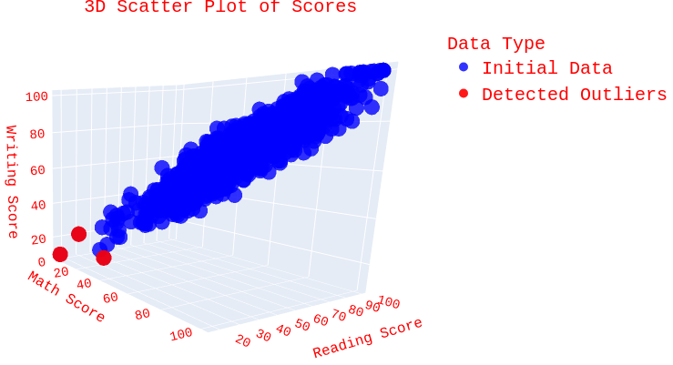
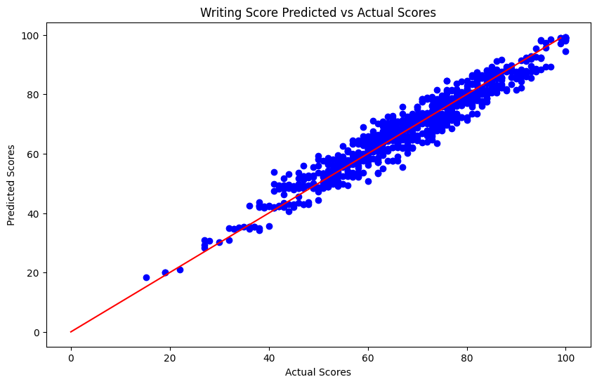

# EduStat Dataset Analysis and Prediction

This repository contains an analysis and predictive modeling project using the EduStat dataset. The primary objectives are to gain insights into factors affecting student performance and to develop predictive models that estimate student scores based on demographic and educational factors.

## Project Overview

In this project, I analyzed student performance data, visualized feature correlations, and trained models to predict students' scores. The project includes preprocessing steps, exploratory data analysis (EDA), feature engineering, model training, and evaluation.

## Online View of the Results and Visualisations:

[View the notebook Online](https://nbviewer.org/github/georgea96/Student_Performance_Analysis/blob/main/students_analysis.html)


## Dataset

The dataset, EduStat was taken from [[here]
](https://www.kaggle.com/datasets/muhammadroshaanriaz/students-performance-dataset-cleaned/data) (credit goes to the contributor of the data), includes fields such as:
- **Student Scores**: Math, Reading, and Writing scores, along with total and average scores
- **Demographic Information**: Gender, race/ethnicity, and parental level of education
- **Educational Features**: Participation in test preparation courses.
- **Lunch:** whether students receive a free/reduced lunch, which is often a socioeconomic indicator.
- **Performance Scores**: Scores in Math, Reading, and Writing, along with total and average scores

## Repository Structure

The repository is organized as follows:

- **data**: Downloaded automatically from Kaggle using Kagglehub.
- **requirements.txt**: File listing the required libraries for the project.

- **notebook**: `students_analysis.ipynb` — The main analysis notebook, which contains code for data loading, exploration, preprocessing, visualization, model training, evaluation, and tuning.

## Project Steps

### 1. Data Exploration and Preprocessing

- **Exploratory Data Analysis**: Examined data distribution, relationships, and potential patterns. Correlation heatmaps were generated to show relationships between demographic and educational features with individual scores and average score.
  
- **Data Preprocessing**:
  - Used one-hot encoding to convert categorical variables (`gender`, `race/ethnicity`, `parental level of education`) into binary features for model compatibility.

* 3D Visualisations of the detected outliers using IQR outlier filtering.

<br/><br/>



### 2. Model Selection and Training

- **Target Variable**: The notebook allows flexibility in selecting the target variable. Models can predict:
  - All 3 Individual scores (e.g., Math, Reading, or Writing score)
  - Specific scores based on other scores as input features

- **Models Used**:
  - Focused on Random Forest Regressor due to its flexibility and the large amount of categorial features included in the dataset.
  - Other models, such as Linear Regression, Decision Trees were also considered initially.
- **Hyperparameter Tuning**:
  - Applied **Grid Search** for hyperparameter tuning, improving model accuracy and generalizability.

- **Feature Importance**: 
   - Computed and ranked the top 10 features by importance in the Random Forest model, providing insights into the most influential factors in predicting student scores.

### 4. Model Evaluation

- **Cross-Validation**: Evaluated model performance using cross-validation with the following metrics:
  - **R^2 Score**: Measures the proportion of variance explained by the model
  - **Root Mean Squared Error (RMSE)**: Provides a sense of the error magnitude in the model's predictions

## Results 

### Quantitative Results and Feature Importance
```
======================================================================
Subject: math_score
======================================================================
Test Root Mean Squared Error: 	6.199838967296009
Train Root Mean Squared Error: 	5.803453801000383
Test R2 Score: 	0.8089371591277158
Train R2 Score: 	0.8551245078947762

Top 10 Features Based on Importance:
                                           Feature  Importance
3                                    reading_score    0.827071
0                                           gender    0.138801
1                                            lunch    0.019183
8                           race_ethnicity_group E    0.003679
5                           race_ethnicity_group B    0.001853
2                          test_preparation_course    0.001581
6                           race_ethnicity_group C    0.001462
13        parental_level_of_education_some college    0.001434
11         parental_level_of_education_high school    0.001142
9   parental_level_of_education_associate's degree    0.001125


Cross-validated Mean Squared Error: 6.496883050504474
Best Parameters: {'max_depth': 5, 'n_estimators': 800}


======================================================================


======================================================================
Subject: writing_score
======================================================================
Test Root Mean Squared Error: 	4.378734131809081
Train Root Mean Squared Error: 	3.829437331572926
Test R2 Score: 	0.9156152853991701
Train R2 Score: 	0.9360840504808379

Top 10 Features Based on Importance:
                                         Feature  Importance
3                                  reading_score    0.982055
2                        test_preparation_course    0.005955
0                                         gender    0.003863
7                         race_ethnicity_group D    0.001621
14  parental_level_of_education_some high school    0.001380
11       parental_level_of_education_high school    0.001055
5                         race_ethnicity_group B    0.000936
6                         race_ethnicity_group C    0.000574
1                                          lunch    0.000523
12   parental_level_of_education_master's degree    0.000488


Cross-validated Mean Squared Error: 4.334388992093969
Best Parameters: {'max_depth': 5, 'n_estimators': 600}
======================================================================
```

### Visualise Predictions
* Math Test Score Predicted From Demographics and Past Reading Test



* Writing Test Score Predicted From Demographics and Past Reading Test


## Main Conclusions

- **Challenging to Predict Scores with Current Features:** Predicting math, reading, and writing scores using only demographic features (lunch, test prep, ethnicity, parent education, and gender) is challenging and lacks accuracy.  <br/><br/>

- **One Known Score Improves Prediction of Others:** Knowing one test score (e.g., math) significantly enhances the accuracy of predicting the other two scores (reading and writing).<br/><br/>

- **Best Predictor for Performance Across Tests:** A single known test score is the best indicator of a student’s performance in the other subjects. The code can be adjusted to experiment with different known test scores as inputs, setting a prior score for one subject or leaving it blank to simulate no prior knowledge.<br/><br/>

- **Key Features for Predicting Math Scores:** For math scores, the most important predictors are a prior test score and gender.<br/><br/>

- **High Importance of Reading/Writing Scores for Each Other:** When predicting reading scores, knowing the writing score is highly predictive (about 90% importance), and vice versa.

## How to Run

1. **Install Requirements**:
   - Use `pip install -r requirements.txt` to install necessary libraries.

   - Tested on `Ubuntu 18.04` using:

        ```bash
        numpy==1.23.4
        plotly==5.24.1
        matplotlib==3.6.2
        scipy==1.8.1
        pandas==1.5.1
        ipython==8.29.0
        kagglehub==0.3.4
        seaborn==0.13.2
        scikit_learn==1.5.2
        ```

2. **Execute Notebook**:
   - Run the `students_analysis.ipynb` notebook to reproduce the analysis and model training steps.

